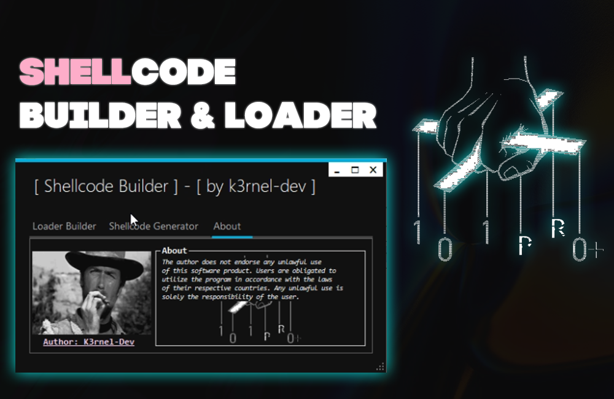

# ShellcodeBuilder-And-Loader

## 📑 About
<b> Most simple tool for generationg shellcode using donut</b>
<strong> Have a builder for creating payload and generating shellcode with using donut.</strong>

## 💻 Screens

  

 

## ⚠️ Disclaimer
 * This project for education and purposes only!
 * Do not use for illegal purposes!s

## ✨ End
<strong>Thanks for watching</strong>